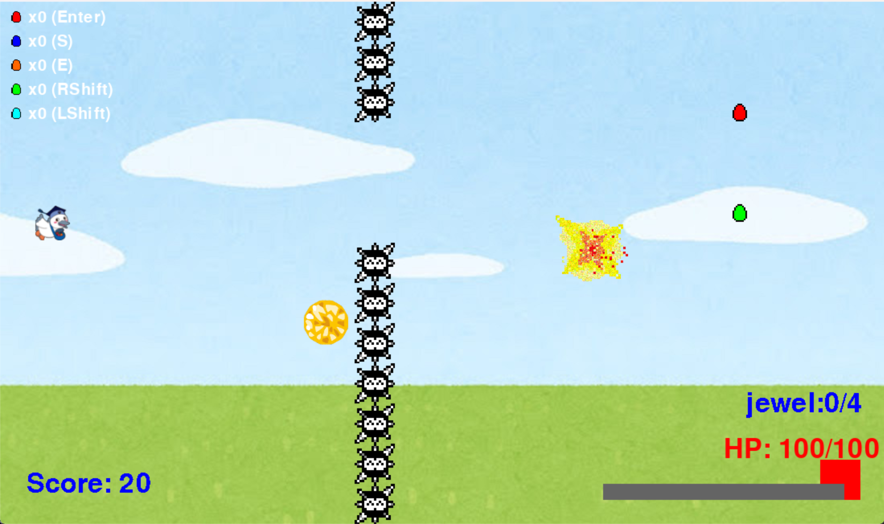
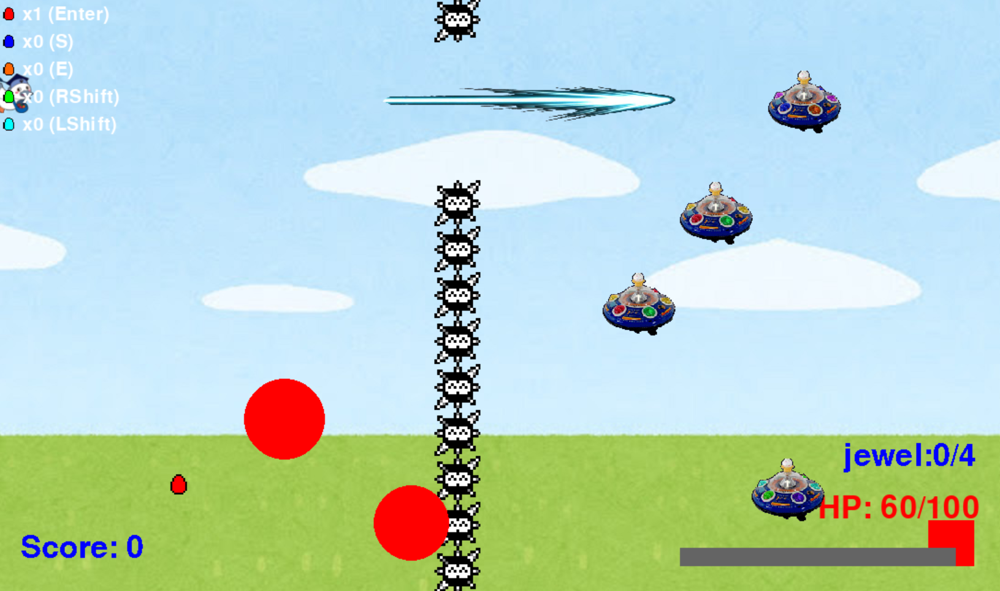
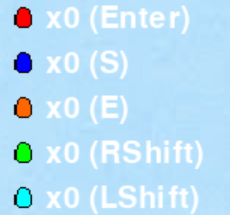

# 横スクロールシューティングゲーム

## 実行環境の必要条件
* python >= 3.10
* pygame >= 2.1

## ゲームの概要
* 主人公キャラクターであるこうかとんを矢印キーで操作し、障害物や敵の攻撃を避けながら4つの宝石を集めるゲーム

## ゲームの遊び方
* 矢印キーでこうかとんを操作し，スペースキー押下によってエネルギー弾を発射し敵を倒したり、敵の攻撃を撃ち落としたりすることができる
* スペースキーを長押しすることで弾速が早いチャージ攻撃ができる

* 次のアイテムを入手したときに対応するキーを押下することで特殊能力が使える
    * 赤玉：Enterキー押下で画面全体に重力場を展開する
    * 青玉：Sキー押下でこうかとんの前に防御壁を展開する
    * 橙玉：Eキー押下で電磁波パルスを発生させる
    * 緑玉：右Shiftキー押下でこうかとんが数秒間無敵状態になる
    * 水玉：左Shiftキー押下で誘導ビーム発射

    
* 右からやってくる棘の壁は攻撃することができず、当たると一発でゲームオーバーになる
* 敵の攻撃はあたるとHPが減り、何度もあたるとゲームオーバーになる
* 4つの宝石を集めることでゲームクリア

## ゲームの実装
### 共通基本機能
* ex4のmusou_koukatonをベースに実装する
* 背景の移動はfrying_koukatonを参考にした

### 分担追加機能
* 敵、障害物機能（守屋）：右から流れてくる敵や障害物を実装する。壁は一つの画像を連ねて作成する。また、壁の隙間は画像三つ分とし、空いている箇所はランダムに変化するものとする。
* チャージショット機能（佐藤）：スペースキーを長押しすることで通常のビームと異なり、早いビームを発射する機能の実装
* HP, ゲームオーバー機能（金成）：主人公のHPの実装およびHPを表示する機能および、ゲームオーバー画面の実装
* アイテム機能（鈴木）右から流れてくるアイテムを取得することで特殊能力が使えるようになる機能の実装
* クリアに必要なアイテム、クリア機能（鍛治倉）：特別なアイテムをいくつか集めることでゲームクリアにする機能の実装
### ToDo
- [ ] 共通機能の実装
- [ ] 体力の変数の統一
- [ ] 担当機能の実装
- [ ] 機能のマージ
- [ ] 動作確認

### メモ